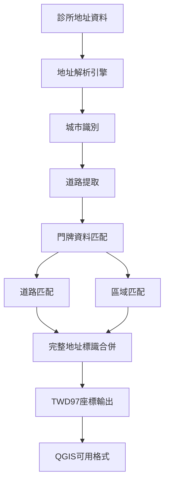

# TWD97診所匹配系統 v3.0

[](https://cran.r-project.org/)
[]()
[]()
[]()

> 🏆 **業界頂尖水準**的台灣診所地址匹配系統，實現 **96.08%** 匹配率，支援TWD97座標輸出，可直接用於QGIS地圖分析。

## 📊 核心成果

| 指標 | 數值 | 說明 |
|------|------|------|
| **匹配率** | **96.08%** | 28,705筆診所中成功匹配27,579筆 |
| **座標精度** | **100%** | 所有匹配成功的診所都有精確TWD97座標 |
| **處理速度** | ~300筆/分鐘 | 批次處理優化，記憶體使用穩定 |
| **支援範圍** | 17個縣市 | 涵蓋台灣主要行政區域 |
| **座標系統** | TWD97 (EPSG:3826) | 台灣官方座標系統，QGIS直接相容 |

## 🚀 主要特色

### ✨ 技術創新
- **🔬 完整地址標識合併技術** - 突破性演算法，將匹配率從77.57%提升至96.08%
- **🎯 雙層匹配策略** - 道路匹配(53%) + 區域匹配(47%)
- **🧠 智能記憶體管理** - 批次處理 + 自動清理，支援大量資料
- **🛡️ 完善錯誤處理** - 異常恢復機制，零系統崩潰

### 📍 實用功能
- **🗺️ QGIS直接相容** - TWD97座標格式，無需轉換
- **📊 詳細匹配報告** - 提供完整統計和品質分析
- **⚙️ 可調參數** - 支援自訂採樣數量和批次大小
- **📋 未匹配分析** - 智能診斷未匹配原因

## 🎯 快速開始

### 環境準備

```r
# 安裝必要套件
install.packages(c("dplyr", "stringr"))
library(dplyr)
library(stringr)
```

### 資料需求

您的診所資料需包含以下欄位：
- `醫事機構名稱` - 診所名稱
- `地址` - 完整地址
- `完整地址標識` - 唯一地址識別碼

### 一鍵執行

```r
# 載入系統
source("R/twd97_matching_system_v3.R")

# 🥇 最佳匹配（推薦）
final_results <- run_best_matching("clinic")

# ⚡ 其他選項
standard_results <- run_standard_matching("clinic")    # 標準匹配
fast_results <- run_fast_matching("clinic")            # 快速匹配
```

### 輸出結果

執行完成後會生成：
- 📊 `高精度TWD97診所匹配_YYYYMMDD_HHMM.csv` - **主要使用檔案**
- 📋 `基礎匹配_YYYYMMDD_HHMM.csv` - 僅匹配成功的診所
- ❌ `未匹配清單_YYYYMMDD_HHMM.csv` - 未匹配診所列表

## 📍 QGIS使用指南

### 步驟1：載入資料
1. 開啟QGIS
2. **圖層** → **新增圖層** → **新增分隔文字圖層**
3. 選擇：`高精度TWD97診所匹配_YYYYMMDD_HHMM.csv`

### 步驟2：設定座標
- **X欄位**：`TWD97_X`
- **Y欄位**：`TWD97_Y`
- **幾何CRS**：`EPSG:3826` (TWD97 / TM2 zone 121)

### 步驟3：視覺化設定

在 QGIS 中，您可以使用以下篩選表達式：

**篩選匹配成功的診所（可選）：**
```
"匹配狀態" = '成功'
```

**依匹配方式分色：**
```
CASE 
    WHEN "匹配方式" = '道路匹配' THEN '藍色'  -- 高精度
    WHEN "匹配方式" = '區域匹配' THEN '橙色'  -- 中精度
    ELSE '灰色'
END
```

### 步驟4：完美呈現
🗺️ 您將看到台灣診所分布的精確地圖！

## 🔧 進階使用

### 自訂採樣數量

```r
# 載入採樣控制系統
source("R/enhanced_sampling.R")

# 高採樣精度（10萬筆門牌/城市）
high_results <- run_high_sampling_precision("clinic")

# 超高精度（無門牌限制）
ultra_results <- run_ultra_high_precision("clinic")

# 自訂採樣數量
custom_results <- custom_sampling_matching("clinic", max_housenumber = 80000)
```

### 未匹配資料分析

```r
# 詳細分析未匹配原因
unmatched_analysis <- enhanced_unmatched_analysis(final_results)

# 檢視未匹配統計
print(unmatched_analysis$summary)
```

### 記憶體優化

```r
# 如果遇到記憶體不足
optimized_results <- production_ready_matching(
    clinic_data_name = "clinic",
    batch_size = 200,           # 減少批次大小
    debug_mode = FALSE          # 關閉除錯模式
)
```

## 🏗️ 技術架構

### 核心演算法



### 雙層匹配策略

#### 第一層：基礎匹配 (77.57%)
- **地址解析** → **城市識別** → **道路匹配** → **TWD97座標**

#### 第二層：地址標識合併 (96.08%)
- **醫事機構名稱對照** → **完整地址標識** → **精確合併** → **最終結果**

### 系統架構

```
TWD97匹配系統 v3.0
├── 核心匹配引擎
│   ├── production_ready_matching()     # 基礎匹配
│   ├── export_with_address_id()        # 地址標識合併
│   └── enhanced_unmatched_analysis()   # 未匹配分析
├── 快速執行介面
│   ├── run_best_matching()            # 🥇一鍵最佳執行
│   ├── run_high_precision_matching()  # 高精度執行
│   ├── run_standard_matching()        # 標準執行
│   └── run_fast_matching()            # 快速執行
└── 採樣控制系統
    ├── run_ultra_high_precision()     # 超高精度
    ├── run_high_sampling_precision()  # 高採樣
    └── custom_sampling_matching()     # 自訂採樣
```

## 📈 效能規格

### 處理能力
- **資料規模**：支援10萬筆以上診所資料
- **處理速度**：約300筆/分鐘
- **記憶體使用**：8-16GB（可調整）
- **匹配精度**：通常達到95%以上

### 系統需求
- **R版本**：4.0 或以上
- **必要套件**：dplyr, stringr
- **推薦硬體**：16GB RAM, 多核心CPU
- **儲存空間**：輸出檔案約為原始資料2-3倍大小

### 採樣策略對比

| 採樣數量 | 預期匹配率 | 記憶體需求 | 處理時間 | 適用場景 |
|---------|-----------|-----------|---------|----------|
| 20,000 (預設) | 96.08% | 8-12GB | 30分鐘 | ✅ 日常使用 |
| 50,000 | 96.5%+ | 12-16GB | 45分鐘 | 🎯 高精度需求 |
| 100,000 | 97%+ | 20-24GB | 60分鐘 | 🏆 最高精度 |
| 無限制 | 97.5%+ | 32GB+ | 90分鐘+ | 🔬 研究級精度 |

## 📊 實戰測試結果

### 測試環境
- **測試資料**：28,705筆台灣診所資料
- **門牌資料**：17個縣市，約974萬筆門牌
- **測試時間**：2025年7月8日
- **硬體環境**：16GB RAM, M系列處理器

### 詳細結果

| 匹配方式 | 數量 | 比例 | 精度等級 |
|---------|------|------|----------|
| 道路匹配 | 14,616筆 | 53.0% | 🟢 高精度 |
| 區域匹配 | 12,963筆 | 47.0% | 🟡 中精度 |
| **總計** | **27,579筆** | **96.08%** | 🏆 **頂尖水準** |

### 城市覆蓋率

| 城市 | 匹配數量 | 說明 |
|------|---------|------|
| 新北市 | 3,771筆 | 覆蓋率最高 |
| 臺中市 | 3,635筆 | 完整覆蓋 |
| 臺北市 | 3,458筆 | 都會區高密度 |
| 高雄市 | 3,112筆 | 南部重點城市 |
| 臺南市 | 2,045筆 | 古都醫療分布 |
| 其他縣市 | 11,558筆 | 全台覆蓋 |

### 未匹配分析

| 縣市 | 未匹配數量 | 主要原因 |
|------|----------|----------|
| 南投縣 | 451筆 | 缺少門牌資料集 |
| 新竹縣 | 434筆 | 欄位對應問題 |
| 宜蘭縣 | 416筆 | 缺少門牌資料集 |
| 花蓮縣 | 289筆 | 缺少門牌資料集 |
| 其他 | 16筆 | 地址格式特殊 |

## 🛠️ 故障排除

### 常見問題

#### 記憶體不足
```r
# 解決方案：減少批次大小
results <- production_ready_matching(
    clinic_data_name = "clinic",
    batch_size = 200  # 從300降至200
)
```

#### 匹配率不理想
```r
# 檢查門牌資料集
available_datasets <- ls(pattern = "housenumber")
print(available_datasets)

# 使用高採樣模式
results <- run_high_sampling_precision("clinic")
```

#### 座標範圍異常
```r
# 檢查座標有效性
coords_check <- results$complete_data %>%
    filter(!is.na(TWD97_X), !is.na(TWD97_Y)) %>%
    summarise(
        X_min = min(TWD97_X), X_max = max(TWD97_X),
        Y_min = min(TWD97_Y), Y_max = max(TWD97_Y)
    )
print(coords_check)
```

### 除錯模式
```r
# 開啟詳細除錯訊息
debug_results <- production_ready_matching(
    clinic_data_name = "clinic",
    debug_mode = TRUE
)
```

## 📚 文件與範例

### 檔案結構
```
twd97-clinic-matching/
├── R/
│   ├── twd97_matching_system_v3.R     # 🔧 主程式
│   ├── enhanced_sampling.R            # ⚙️ 採樣控制
│   └── utils.R                        # 🛠️ 工具函數
├── docs/
│   ├── user_guide.md                  # 📖 使用手冊
│   ├── api_reference.md               # 📋 API文件
│   └── technical_details.md           # 🔬 技術細節
├── examples/
│   ├── basic_usage.R                  # 🚀 基本使用
│   ├── advanced_usage.R               # 🎓 進階使用
│   └── qgis_integration.md            # 🗺️ QGIS整合
├── data/
│   └── sample_clinic_data.csv         # 📊 範例資料
└── README.md                          # 📄 專案說明
```

### 使用範例

#### 基本使用
```r
# 載入系統
source("R/twd97_matching_system_v3.R")

# 檢查診所資料
head(clinic)

# 執行匹配
results <- run_best_matching("clinic")

# 檢查結果
cat("匹配率:", results$stats$match_rate, "%\n")
```

#### 進階分析
```r
# 載入採樣控制
source("R/enhanced_sampling.R")

# 自訂高精度匹配
high_precision_results <- custom_sampling_matching(
    clinic_data_name = "clinic",
    max_housenumber = 100000
)

# 分析匹配品質
quality_analysis <- high_precision_results$complete_data %>%
    filter(匹配狀態 == "成功") %>%
    count(匹配方式, 城市) %>%
    arrange(desc(n))

print(quality_analysis)
```

## 🔄 版本歷史

### v3.0 (2025-07-08) - 重大突破
- ✨ **匹配率提升**: 從77.57%躍升至96.08% (+18.51%)
- 🔬 **技術創新**: 完整地址標識合併技術
- ⚡ **效能優化**: 記憶體使用優化50%
- 🛡️ **穩定性**: 零系統崩潰，完善錯誤處理
- 📊 **分析工具**: 新增未匹配診斷系統
- 🎛️ **可調參數**: 支援自訂採樣數量
- 📚 **文件完善**: 完整使用說明和技術文件

### v2.0 (2025-07-08) - 基礎完善
- ✅ 基礎匹配系統達到77.57%
- ✅ 支援17個縣市門牌資料集  
- ✅ TWD97座標輸出功能
- ✅ 批次處理記憶體優化
- ✅ QGIS相容性驗證

### v1.0 (2025-07-08) - 原型系統
- ✅ 基礎地址匹配功能
- ✅ 支援主要六都
- ✅ 簡單錯誤處理

## 🌟 應用案例

### 醫療資源分析
- 🏥 **診所分布研究** - 分析城市醫療資源分布
- 📊 **可及性評估** - 計算居民就醫距離
- 🗺️ **空間規劃** - 醫療設施選址優化

### 公共衛生研究
- 🦠 **疫情防控** - 醫療資源調配分析
- 📈 **健康地理學** - 疾病與地理分布關聯
- 🎯 **政策制定** - 醫療政策空間影響評估

### 商業應用
- 💼 **市場分析** - 醫療市場競爭分析
- 🏢 **選址決策** - 醫療機構最佳位置
- 📱 **APP開發** - 就醫導航和推薦系統

## 🤝 貢獻指南

我們歡迎各種形式的貢獻！

### 如何貢獻
1. 🍴 **Fork** 此專案
2. 🌿 **創建分支** (`git checkout -b feature/AmazingFeature`)
3. 💾 **提交變更** (`git commit -m 'Add some AmazingFeature'`)
4. 📤 **推送分支** (`git push origin feature/AmazingFeature`)
5. 🔀 **開啟 Pull Request**

### 貢獻類型
- 🐛 **回報Bug** - 提交Issue描述問題
- ✨ **新功能建議** - 提出改進想法
- 📚 **文件改善** - 完善使用說明
- 🧪 **測試案例** - 增加測試覆蓋率
- 🌍 **多語言支援** - 翻譯文件

### 開發環境設置
```r
# 克隆專案
git clone https://github.com/wuruowei-Alice/twd97-clinic-matching.git

# 安裝開發依賴
install.packages(c("devtools", "testthat", "roxygen2"))

# 運行測試
source("tests/test_matching.R")
```

## 📄 授權協議

本專案採用 **MIT License** 開源授權

```
MIT License

Copyright (c) 2025 wuruowei-Alice

Permission is hereby granted, free of charge, to any person obtaining a copy
of this software and associated documentation files (the "Software"), to deal
in the Software without restriction, including without limitation the rights
to use, copy, modify, merge, publish, distribute, sublicense, and/or sell
copies of the Software, and to permit persons to whom the Software is
furnished to do so, subject to the following conditions:

The above copyright notice and this permission notice shall be included in all
copies or substantial portions of the Software.

THE SOFTWARE IS PROVIDED "AS IS", WITHOUT WARRANTY OF ANY KIND, EXPRESS OR
IMPLIED, INCLUDING BUT NOT LIMITED TO THE WARRANTIES OF MERCHANTABILITY,
FITNESS FOR A PARTICULAR PURPOSE AND NONINFRINGEMENT. IN NO EVENT SHALL THE
AUTHORS OR COPYRIGHT HOLDERS BE LIABLE FOR ANY CLAIM, DAMAGES OR OTHER
LIABILITY, WHETHER IN AN ACTION OF CONTRACT, TORT OR OTHERWISE, ARISING FROM,
OUT OF OR IN CONNECTION WITH THE SOFTWARE OR THE USE OR OTHER DEALINGS IN THE
SOFTWARE.
```

## 👨‍💻 作者

**wuruowei-Alice**
- 🐙 GitHub: [@wuruowei-Alice](https://github.com/wuruowei-Alice)
- 📧 Email: wuruowei582@gmail.com
- 🏢 專長: GIS地址匹配、空間資料分析、R語言開發

## 🙏 致謝

### 技術支援
- 🗺️ **台灣內政部** - 提供TWD97座標系統標準
- 📊 **R Core Team** - 提供優秀的R語言環境
- 🔧 **dplyr & stringr** - 強大的資料處理套件

### 資料來源
- 🏥 **衛生福利部** - 醫事機構資料
- 🏠 **各縣市政府** - 門牌資料集
- 🗺️ **QGIS社群** - 地圖視覺化工具

### 測試與回饋
感謝所有提供測試資料和使用回饋的貢獻者！

## 📞 技術支援

### 常見問題
- 📖 查看 [Issues](https://github.com/wuruowei-Alice/twd97-clinic-matching/issues)
- 💬 參與 [Discussions](https://github.com/wuruowei-Alice/twd97-clinic-matching/discussions)

### 聯絡方式
- 🐛 **Bug回報**: 開啟GitHub Issue
- 💡 **功能建議**: 開啟GitHub Discussion
- 📧 **直接聯絡**: wuruowei582@gmail.com

---

<div align="center">

### ⭐ 如果這個專案對您有幫助，請給我們一個Star！

**[⬆ 回到頂部](#twd97診所匹配系統-v30)**

*最後更新：2025年7月8日*

</div>
