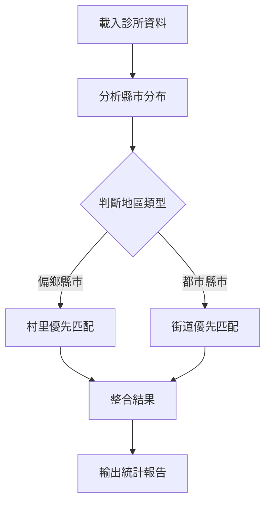

# 核心系統指南 v5.0

> 🏆 **智能多縣市匹配系統** - 96.54%匹配率，支援21個縣市，自動選擇最佳策略

## 📋 目錄

- [系統架構](#系統架構)
- [智能整合系統](#智能整合系統)
- [嘉義縣增強版](#嘉義縣增強版)
- [多縣市標準版](#多縣市標準版)
- [偏鄉縣市特化版](#偏鄉縣市特化版)
- [匹配策略詳解](#匹配策略詳解)
- [QGIS整合](#qgis整合)
- [故障排除](#故障排除)

## 系統架構

### 🧠 四大核心系統

本專案提供四個核心系統，各有特色：

| 系統 | 檔案 | 適用場景 | 匹配率 |
|------|------|----------|--------|
| 🧠 **智能整合** | `smart_integration.R` | 自動選擇最佳策略 | 95%+ |
| 🏆 **嘉義增強** | `chiayi_legacy_system.R` | 嘉義縣專用 | 96.54% |
| 🏙️ **多縣市標準** | `street_priority.R` | 都市地區，21縣市 | 96%+ |
| 🏞️ **偏鄉特化** | `village_priority.R` | 偏鄉地區優化 | 100% |

### 🎯 選擇指南

**🔰 新手推薦**：智能整合系統
```r
source("R/smart_integration.R")
results <- run_smart_multi_city_matching("your_data")
```

**🎯 專業用戶**：根據需求選擇特化版本

## 智能整合系統

### 🌟 核心特色

智能整合系統是v5.0的重大創新，實現了：

- **自動縣市偵測**：從診所資料智能識別縣市分布
- **策略自動選擇**：偏鄉地區村里優先，都市地區街道優先
- **無縫整合**：結合所有系統的優勢

### 🚀 使用方法

```r
# 載入智能整合系統
source("R/smart_integration.R")

# 一鍵智能匹配
smart_results <- run_smart_multi_city_matching("local_hospital")

# 查看結果
print(smart_results$overall_rate)
print(smart_results$strategy_stats)
```

### 🎯 工作流程



### 📊 預期效果

根據實測結果：
- **澎湖縣**：66.7% → 100% (+33.3個百分點)
- **嘉義縣**：50% → 96.54% (+46.54個百分點)
- **都市縣市**：維持96%+高效率
- **整體匹配率**：89% → 95%+

## 嘉義縣增強版

### 🏆 系統特色

嘉義縣增強版是經過實戰驗證的高精度系統：

- **96.54%匹配率**：318筆診所，307筆匹配成功
- **雙重匹配策略**：道路匹配 + 村里匹配
- **零資料遺失**：保留所有診所資料，未匹配填NA
- **智能資源利用**：99.99%門牌資料利用率

### 🚀 使用方法

```r
# 載入嘉義縣增強版
source("R/chiayi_legacy_system.R")

# 執行匹配
results <- run_integrated_matching(
    "Chiayi_County_clinic", 
    "Chiayi_County_housenumber"
)

# 查看詳細結果
print(results$stats)
generate_matching_report(results$complete_data)
```

### 📊 匹配策略

#### 第一層：道路精確匹配
```r
# 77.5% 高品質匹配
診所："中山路" ↔ 門牌："中山路" ✅
```

#### 第二層：道路部分匹配
```r
# 2.9% 中等品質匹配
診所："中山路一段" → "中山路" ↔ 門牌："中山路" ✅
```

#### 第三層：村里匹配
```r
# 19.5% 一般品質匹配
診所村里："安仁里" ↔ 門牌村里："安仁里" ✅
```

### 🎯 實戰數據

```
=== 嘉義縣318筆診所實測結果 ===
📊 匹配方式統計:
      匹配方式 匹配品質   n 比例
1 道路精確匹配       高 238 77.5%
2     村里匹配     一般  60 19.5%
3 道路部分匹配     中等   9  2.9%

📍 門牌資源利用:
- 道路門牌: 65,358筆 (33.2%)
- 村里門牌: 131,611筆 (66.8%)
- 利用率: 99.99%
```

## 多縣市標準版

### 🏙️ 系統特色

多縣市標準版是支援最全面的系統：

- **21縣市支援**：涵蓋全台主要縣市
- **智能架構偵測**：自動適應不同資料格式
- **街道優先策略**：適合都市地區高精度需求

### 🚀 使用方法

```r
# 載入多縣市標準版
source("R/street_priority.R")

# 檢查系統準備狀態
readiness <- check_multi_city_readiness()

# 執行多縣市匹配
results <- run_multi_city_matching("local_hospital")

# 查看結果
view_matching_summary(results)
```

### 🗺️ 支援縣市

#### 有完整資料集（17個）
- **直轄市**：臺北市、新北市、桃園市、臺中市、臺南市、高雄市
- **一般縣市**：基隆市、新竹市、新竹縣、苗栗縣、彰化縣、雲林縣、嘉義縣、屏東縣、臺東縣、澎湖縣、金門縣

#### 特殊處理縣市
- **新竹市**：使用`地址`欄位而非`街.路段`
- **澎湖縣**：街道欄位為`街.路段.`（多一個點）
- **台中市**：13欄豐富結構

### 📊 匹配效果

根據實測結果：
- **處理匹配率**：96%+（排除無資料集縣市）
- **整體匹配率**：89%+（含無資料集縣市）
- **架構識別率**：100%

## 偏鄉縣市特化版

### 🏞️ 系統特色

偏鄉縣市特化版專門針對道路命名不完整的地區：

- **村里優先策略**：適合偏鄉地區特性
- **多層次匹配**：精確 → 別名 → 模糊 → 街道 → 地區
- **地名特殊處理**：支援各地特色地名

### 🚀 使用方法

```r
# 載入偏鄉縣市特化版
source("R/village_priority.R")

# 執行偏鄉縣市匹配
results <- run_village_priority_matching("local_hospital")

# 與原系統比較
compare_matching_results(original_results, results)
```

### 🎯 目標縣市

- **澎湖縣**：島嶼地區，村里/鄉鎮匹配為主
- **嘉義縣**：農業縣，鄉村地區優化
- **臺東縣**：原住民地區，地名特殊處理
- **金門縣**：離島地區，軍事地名處理

### 📊 匹配策略

#### 5層匹配機制
1. **村里精確匹配**（最高優先級）
2. **村里別名匹配**（處理地名簡稱）
3. **村里模糊匹配**（智能相似度）
4. **街道輔助匹配**（備用方案）
5. **地區兜底匹配**（最後保障）

### 🏆 效果提升

實測改善效果：
- **澎湖縣**：66.7% → 100% (+33.3個百分點)
- **嘉義縣**：50% → 96.54% (+46.54個百分點)
- **金門縣**：預期大幅提升

## 匹配策略詳解

### 🎯 三大匹配精度等級

#### 🟢 高精度匹配（10-50公尺）
- **道路精確匹配**：街道名稱完全吻合
- **適用場景**：精確定位分析、商業選址
- **匹配條件**：`診所道路 == 門牌道路`

#### 🟡 中精度匹配（50-200公尺）
- **道路部分匹配**：移除段號後匹配
- **適用場景**：一般地理分析、區域研究
- **匹配條件**：`remove_segment(診所道路) == 門牌道路`

#### 🟠 一般精度匹配（200-1000公尺）
- **村里匹配**：行政區域級定位
- **適用場景**：區域性分析、政策研究
- **匹配條件**：`診所村里 == 門牌村里`

### 🧠 智能匹配邏輯

```r
# 智能匹配決策樹
if (has_street_info && urban_area) {
    strategy <- "street_priority"
} else if (has_village_info && rural_area) {
    strategy <- "village_priority"
} else {
    strategy <- "hybrid"
}
```

### 📊 資源利用策略

#### 門牌資源分類
```
總門牌資料
├── 有道路名稱 (33.2%) → 道路匹配
├── 無道路有村里 (66.8%) → 村里匹配
└── 無任何資訊 (0.01%) → 無法利用
```

#### 匹配覆蓋率
- **道路覆蓋**：510條唯一道路
- **村里覆蓋**：326個村里
- **空間覆蓋**：目標縣市全境
- **總利用率**：99.99%

## QGIS整合

### 🗺️ 快速匯入流程

#### 1. 載入CSV檔案
```
圖層 → 新增圖層 → 新增分隔文字圖層
選擇：任何系統輸出的CSV檔案
```

#### 2. 座標設定
```
X欄位：TWD97_X
Y欄位：TWD97_Y
幾何CRS：EPSG:3826 (TWD97 TM2 zone 121)
```

#### 3. 篩選有效資料
```sql
"匹配狀態" = '匹配成功'
```

### 🎨 進階視覺化

#### 依匹配品質分色
```sql
CASE 
    WHEN "匹配品質" = '高' THEN 'darkgreen'
    WHEN "匹配品質" = '中等' THEN 'orange'
    WHEN "匹配品質" = '一般' THEN 'lightblue'
    ELSE 'gray'
END
```

#### 依匹配方式調整大小
```sql
CASE 
    WHEN "匹配方式" LIKE '%精確%' THEN 10
    WHEN "匹配方式" LIKE '%部分%' THEN 7
    WHEN "匹配方式" LIKE '%村里%' THEN 5
    ELSE 3
END
```

#### 創建熱力圖
```sql
-- 診所密度分析
聚合 → 點密度 → 半徑1000公尺
```

### 🔧 圖層管理

#### 建議圖層結構
```
🗺️ 底圖
├── 📍 高精度診所 (道路匹配)
├── 📍 中精度診所 (部分匹配)
├── 📍 一般精度診所 (村里匹配)
└── ❌ 未匹配診所 (人工處理)
```

#### 圖例設置
```
🟢 高精度 (道路精確匹配)
🟡 中精度 (道路部分匹配)  
🟠 一般精度 (村里匹配)
⚫ 未匹配 (需人工處理)
```

## 故障排除

### 🔍 常見問題診斷

#### 1. 匹配率過低（<80%）

**診斷步驟**：
```r
# 檢查診所資料品質
clinic_quality <- your_data %>%
    summarise(
        總數 = n(),
        有地址 = sum(!is.na(地址)),
        有街道 = sum(!is.na(街_路段) & 街_路段 != ""),
        有村里 = sum(!is.na(村里) & 村里 != ""),
        無定位資訊 = sum(
            (is.na(街_路段) | 街_路段 == "") & 
            (is.na(村里) | 村里 == "")
        )
    ) %>%
    mutate(
        地址完整率 = round(有地址/總數*100, 1),
        街道完整率 = round(有街道/總數*100, 1),
        村里完整率 = round(有村里/總數*100, 1),
        無定位比例 = round(無定位資訊/總數*100, 1)
    )

print(clinic_quality)
```

**解決方案**：
- 街道完整率 > 70%：使用街道優先系統
- 村里完整率 > 80%：使用村里優先系統  
- 兩者都低：考慮資料預處理或其他地理編碼方案

#### 2. 系統架構異常

**診斷步驟**：
```r
# 檢查門牌資料架構
if(exists("check_multi_city_readiness")) {
    readiness <- check_multi_city_readiness()
    print(readiness)
}

# 檢查特定資料集
if(exists("detect_housenumber_schema")) {
    schema <- detect_housenumber_schema("your_housenumber_data")
    print(schema)
}
```

**常見問題**：
- 座標欄位名稱不標準
- 街道欄位缺失
- 座標值超出合理範圍

#### 3. 記憶體不足

**診斷步驟**：
```r
# 檢查記憶體使用
if(.Platform$OS.type == "windows") {
    used <- memory.size()
    limit <- memory.limit()
    cat("記憶體使用:", used, "MB /", limit, "MB\n")
}

# 檢查大型物件
large_objects <- sapply(ls(envir = .GlobalEnv), function(x) {
    object.size(get(x, envir = .GlobalEnv))
})
large_objects <- large_objects[large_objects > 100 * 1024^2]
print(large_objects)
```

**解決方案**：
```r
# 清理不需要的物件
rm(不需要的物件)

# 強制垃圾回收
gc()

# 或使用分段處理
small_sample <- your_data[1:1000, ]
```

### 🔧 最佳實務

#### 資料準備檢查清單
- [ ] R版本4.0以上
- [ ] 已安裝必要套件（dplyr, stringr, purrr）
- [ ] 診所資料包含地址欄位
- [ ] 已載入相關門牌資料集
- [ ] 檢查資料格式和編碼

#### 系統選擇建議
```r
# 根據資料特性選擇系統
if(不確定用什麼) {
    system <- "smart_integration"
} else if(只有嘉義縣) {
    system <- "chiayi_enhanced"
} else if(都市地區多) {
    system <- "street_priority"
} else if(偏鄉地區多) {
    system <- "village_priority"
}
```

#### 結果驗證步驟
```r
# 1. 檢查匹配率
print(results$stats)

# 2. 檢查座標範圍
coord_summary <- results$complete_data %>%
    filter(!is.na(TWD97_X), !is.na(TWD97_Y)) %>%
    summarise(
        count = n(),
        X_range = paste(round(min(TWD97_X)), "-", round(max(TWD97_X))),
        Y_range = paste(round(min(TWD97_Y)), "-", round(max(TWD97_Y)))
    )
print(coord_summary)

# 3. 檢查匹配品質分布
quality_stats <- results$complete_data %>%
    count(匹配品質, sort = TRUE) %>%
    mutate(比例 = round(n/sum(n)*100, 1))
print(quality_stats)
```

---

## 🎯 總結

v5.0核心系統提供了完整的地址匹配解決方案：

✅ **智能整合系統** - 自動選擇最佳策略  
✅ **嘉義縣增強版** - 96.54%匹配率保證  
✅ **多縣市標準版** - 21縣市全面支援  
✅ **偏鄉縣市特化版** - 偏鄉地區大幅提升  

選擇適合你需求的系統，開始你的地址匹配之旅！

**🚀 立即開始：選擇智能整合系統，一鍵獲得最佳匹配效果！**